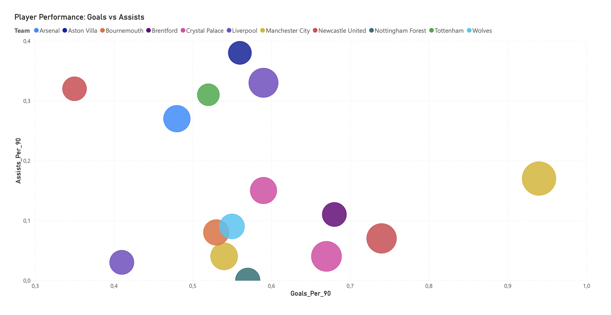

⚽ Football Scouting Dashboard

This project is a data-driven football scouting dashboard built using Power BI.
The goal is to analyze player performance and identify top attacking talents based on key metrics.

📊 Key Features
Interactive scatter plot: Goals per 90 vs Assists per 90
Custom Scouting Score combining multiple performance metrics
Filtering by position (focus on forwards)
Top N player analysis
Cleaned and transformed dataset using Power Query
🧠 Metrics Used
Goals per 90
Assists per 90
Goal Contributions per 90
Efficiency Rating
Custom Scouting Score
⚙️ Tools & Technologies
Power BI
Power Query
Data transformation and modeling
GitHub for version control
📈 Purpose

The purpose of this project is to demonstrate how data can support scouting and decision-making in football.
It also showcases my transition into data analytics and my ability to work with real-world datasets.

 📊 Dashboard Preview
 

🚀 Future Improvements
Add more advanced metrics (xG, xA)
Include multiple leagues
Build automated data pipeline
👤 Author

Khalil Raslan Mashinesh
